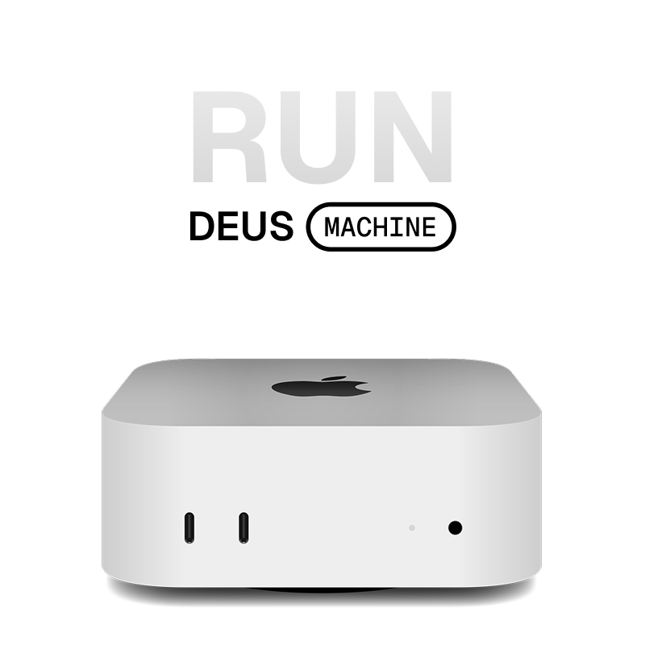

<p align="center">
  
</p>

<h3 align="center">
  Your AI dev server. Access from anywhere.
</h3>

<p align="center">
  Run AI coding agents on your own machine — Mac, Linux, or any server.<br/>
  Connect from desktop, phone, browser, or Slack. Agents keep working when you walk away.
</p>

<p align="center">
  <a href="https://github.com/zvadaadam/deus-machine/stargazers"></a>&nbsp;
  <a href="https://github.com/zvadaadam/deus-machine/releases/latest"></a>&nbsp;
  <a href="LICENSE"></a>&nbsp;
  <a href="https://discord.gg/deus-machine"></a>
</p>

<p align="center">
  <a href="https://github.com/zvadaadam/deus-machine/releases/latest"></a>&nbsp;&nbsp;
  <a href="https://github.com/zvadaadam/deus-machine/releases/latest"></a>
</p>

<p align="center">
  <a href="https://deusmachine.ai">Website</a> · <a href="https://discord.gg/deus-machine">Discord</a> · <a href="https://github.com/zvadaadam/deus-machine/releases">Releases</a> · <a href="CONTRIBUTING.md">Contributing</a>
</p>

<!-- TODO: Replace with product screenshot showing 3+ parallel workspaces -->

---

## Why Deus?

Deus turns any machine into an always-on AI dev server. Install it on a Mac Mini, a Linux box, or a cloud VM. Spin up agents, close your laptop, and check back from your phone — they keep working.

- **Desktop app** — full workspace UI on Mac or Linux
- **Web browser** — open [app.deusmachine.ai](https://app.deusmachine.ai) from any computer
- **Phone** — monitor agents, review results, send messages on the go
- **Slack** — send tasks and check status without leaving chat _(coming soon)_

Your code stays on your machine. You bring your own API key and pay Anthropic or OpenAI directly. No per-seat fees. No vendor cloud. Open source, MIT licensed.

<p align="center">
  
</p>

## What you get

<!-- TODO: Screenshot of a single workspace — chat on left, live diff on right -->

- **Parallel workspaces** — run multiple agents at once. Each gets its own git branch, terminal, and browser — fully isolated, zero conflicts.

- **Built-in browser** — agents can open pages, click, take screenshots, and verify their own work. No separate Playwright/Puppeteer setup needed.

- **Terminal access** — each workspace gets a full terminal. Agents run commands, install packages, run tests, and read the output in real time.

- **Live diffs** — see exactly what each agent is editing as it works, across all workspaces simultaneously.

- **Claude Code + Codex** — works with Anthropic's Claude Code and OpenAI's Codex. Bring your own API key.

- **Monitor from your phone** — start agents on your server, check progress from any browser. Go to dinner, check your phone, three features are done.

<!-- TODO: Screenshot of side-by-side desktop and mobile web UI -->

- **Extensible** — add MCP servers, hooks, or your own scripts to customize each workspace.

## Get started

### 1. Install

**Desktop app (recommended)** — download for [macOS](https://github.com/zvadaadam/deus-machine/releases/latest) or [Linux](https://github.com/zvadaadam/deus-machine/releases/latest) from GitHub Releases.

**CLI on any machine** — one command:

```bash
npx deus-machine
```

### 2. Connect your AI agent

First launch walks you through setup. You'll need the [Claude Code CLI](https://docs.anthropic.com/en/docs/claude-code) installed, or an API key from [Anthropic](https://console.anthropic.com/) or [OpenAI](https://platform.openai.com/).

### 3. Start building

Point Deus at a repo, describe a task, and the agent gets to work. Open more workspaces to run more tasks in parallel.

No account required. Your API key, your machine, your code.

## FAQ

<details>
<summary><strong>Is it free?</strong></summary>
<br/>
Yes. Deus is open source (MIT). You bring your own API key and pay for token usage directly with Anthropic or OpenAI.
</details>

<details>
<summary><strong>What agents does it support?</strong></summary>
<br/>
Claude Code (Anthropic) and Codex (OpenAI). Adding new agents requires implementing the <code>AgentHandler</code> interface in the agent server.
</details>

<details>
<summary><strong>Does my code leave my machine?</strong></summary>
<br/>
No. Agents run locally. API calls go directly from your machine to Anthropic/OpenAI. The only external connection is the optional relay for remote access — it forwards WebSocket frames without storing them. The <a href="apps/cloud-relay/">relay source code</a> is in this repo. You can self-host it or disable remote access entirely.
</details>

<details>
<summary><strong>How is this different from Conductor, Devin, or Cursor?</strong></summary>
<br/>
Conductor is a Mac desktop app for running parallel agents locally. Deus is an AI dev server — it runs on any machine (Mac, Linux, cloud VM) and you connect from a desktop app, your phone, a browser, or Slack. If you want a polished Mac-native experience, Conductor is great. If you want a server you can access from anywhere on hardware you choose, that's what Deus is built for.
<br/><br/>
Devin and Cursor background agents run on cloud infrastructure — your code goes to their servers. Deus runs entirely on your own hardware.
</details>

<details>
<summary><strong>Can I run it on a remote server?</strong></summary>
<br/>
Yes — that's a first-class use case. Run <code>npx deus-machine</code> on any server, then connect from your laptop or phone via <a href="https://app.deusmachine.ai">app.deusmachine.ai</a>. No inbound ports needed.
</details>

## Current status

Deus is pre-1.0 software (currently v0.3.x). Under active development.

**Works well:** parallel workspaces with git isolation, Claude Code and Codex integration, real-time diffs and terminal streaming, headless server mode, mobile web pairing.

**Coming soon:** native mobile app, Slack integration.

**Known limitations:** single-user only (no team accounts or SSO yet), no built-in API cost tracking, no Windows desktop app (CLI works on WSL).

<details>
<summary><strong>Architecture</strong></summary>
<br/>

Three processes, all on your machine:

```
┌─────────────────────────────────────────────────────────┐
│  Frontend (React)                                       │
│  Desktop: Electron  /  Web: app.deusmachine.ai          │
└──────────┬──────────────────────────────┬───────────────┘
           │ WebSocket                    │ Electron IPC
           │ (subscriptions, commands)    │ (native-only)
┌──────────▼──────────────────────────────▼───────────────┐
│  Backend (Node.js + Hono)                               │
│  All business logic: SQLite, git worktrees, file        │
│  watching, PTY, agent event persistence, WS push        │
└──────────┬──────────────────────────────────────────────┘
           │ JSON-RPC 2.0 over WebSocket
┌──────────▼──────────────────────────────────────────────┐
│  Agent Server (Node.js)                                 │
│  Stateless. Wraps Claude Code + Codex SDKs.             │
│  Separate process for crash isolation.                  │
└─────────────────────────────────────────────────────────┘
```

All data lives in a local SQLite database. The agent server is stateless — if it crashes, the backend survives. Remote access uses an optional outbound WebSocket tunnel to a [Cloudflare Worker relay](apps/cloud-relay/) (no inbound ports needed). The relay forwards frames without inspecting or storing them — [source code included](apps/cloud-relay/).

</details>

## Build from source

<details>
<summary>Instructions for contributors</summary>

```bash
git clone https://github.com/zvadaadam/deus-machine.git
cd deus-machine
bun install
bun run dev        # Desktop: Electron + backend + agent-server
bun run dev:web    # Web: backend + frontend (no Electron)
```

Requires Node.js 22+ and [Bun](https://bun.sh) 1.2+. Do not use npm or yarn for installation.

See [CONTRIBUTING.md](CONTRIBUTING.md) for development setup and [CLAUDE.md](CLAUDE.md) for architecture details.

</details>

## Community

- [Discord](https://discord.gg/deus-machine) — questions, setups, bugs
- [GitHub Issues](https://github.com/zvadaadam/deus-machine/issues) — bug reports and feature requests
- [GitHub Discussions](https://github.com/zvadaadam/deus-machine/discussions) — ideas and show-and-tell

## License

[MIT](LICENSE)
