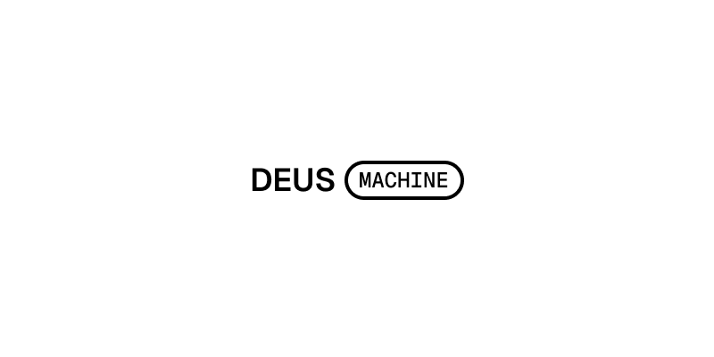

<p align="center">
  
</p>

<p align="center">
  An operating environment for AI coding agents.<br/>
  Parallel workspaces, each with its own terminal, browser, and git branch.<br/>
  Desktop app, headless server, or mobile web.
</p>

<p align="center">
  <a href="https://github.com/zvadaadam/deus-machine/releases/latest"></a>&nbsp;&nbsp;
  <a href="https://github.com/zvadaadam/deus-machine/releases/latest"></a>
</p>

<p align="center">
  <a href="https://deusmachine.ai">Website</a> · <a href="https://github.com/zvadaadam/deus-machine/releases">All Releases</a> · <a href="CONTRIBUTING.md">Contributing</a>
</p>

## How to run it

Deus runs in three modes depending on your setup:

### Desktop app

Download the macOS app from [GitHub Releases](https://github.com/zvadaadam/deus-machine/releases). Open the DMG, drag `Deus.app` into `Applications`, then launch it from `Applications`.

If Deus detects that it is running from a disk image, Downloads, or another transient location, it will ask to move itself into `Applications` before continuing.

### Headless server (CLI)

Install the CLI on any machine — a remote server, a VM, a container — and run Deus without a GUI:

```bash
npx deus-machine
```

On a headless machine, this starts the backend and agent server. First run walks you through setup (AI agent config, remote access). Once running, it shows a QR code you can scan to connect.

```bash
# Or install globally
npm install -g deus-machine
deus start
```

See all CLI commands in the [CLI docs](apps/cli/README.md).

### Web

Go to [app.deusmachine.ai](https://app.deusmachine.ai) and pair with a running desktop or server instance. Works on mobile too — monitor your agents from your phone.

## What you get

- **Parallel workspaces** — multiple agents working on different tasks at the same time, each in its own git worktree
- **Built-in browser** — agents can open pages, click, screenshot, and verify what they built
- **Terminal access** — agents run commands, install deps, run tests, read CI output
- **Live diffs and file changes** — see what each agent is doing in real-time
- **Bring your own agent** — works with Claude Code, Codex, or any agent SDK
- **MCP servers and hooks** — plug in your own tools and customize per workspace
- **Mobile access** — pair your phone to a running instance and check in from anywhere

## Build from source

```bash
git clone https://github.com/zvadaadam/deus-machine.git
cd deus-machine
bun install
bun run dev
```

Requires Node.js 22+ and Bun 1.2+.

## Contributing

See [CONTRIBUTING.md](CONTRIBUTING.md) for how to contribute and [CLAUDE.md](CLAUDE.md) for architecture details.

## License

Elastic License 2.0 (ELv2) — see [LICENSE](LICENSE) for details.
