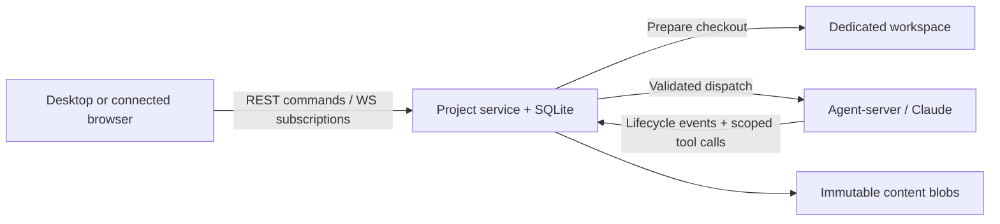

# Local Projects

Projects coordinate a defined deliverable across local coding agents. A coordinator delegates work, receives durable child outcomes, reviews evidence and presents a combined result for human review. This implementation uses one local Git repository and one fixed Claude model per Project. Ongoing autonomous creation of new work is not the default.

Projects require the local Deus backend and agent-server to remain running. The desktop and browsers connected to that backend share the feature; the standalone cloud web client does not execute local Projects.

## Using a Project

1. Open **Projects** below Automations in the sidebar. Its heading expands individual Projects with live working, queued, ready, done or attention states. Use **+** to create a Project in the same prompt modal as a workspace: select its repository and Claude model, name the Project (the repository name is the default; a brief's first line is used when only a brief is typed), and optionally describe the deliverable. There is no separate all-Projects screen. Deus prepares a coordinator workspace without depending on an open chat panel and shows the preparation steps (worktree, environment, repository setup, coordinator) in the coordinator pane. With a brief, the coordinator starts on it as soon as the workspace is ready. Without one, the coordinator opens with a short welcome that asks what to accomplish (the first Project ever created also explains what a Project is); your first message is then published as `brief.md` and the overview shows **Nothing to track yet** until it arrives.
2. Follow the coordinator conversation and the overview of agents, results and PR links. The coordinator is the Project's one conversation and its first, pinned tab. Opening an Agent — from its overview row, from a **Create agent** card or an agent's result in the coordinator's conversation — adds that Agent's conversation as another tab beside it, and its composer talks to that Agent. **Overview** and **Documents** stay Project-wide; **Files**, **Changes**, **Terminal** and the other workspace tabs follow the selected tab's own worktree, so each Agent's changes are reviewed separately. An overview row shows the Agent's uncommitted line counts, which open its Changes. Open tabs are remembered per Project; closing one returns to its left neighbour. The header's **Open** menu opens the selected Agent's worktree in an editor, and Project options can still open its full workspace view, where **← Project** returns, including from the full-width file view and phone layout. Project-owned workspaces are listed within the Project rather than duplicated in repository sidebar groups.
3. Send further instructions through the Project composer. Messages remain queued while their recipient is busy or paused. The Project exposes the oldest 50 queued human messages with the full count. You can cancel a message until it belongs to a reserved dispatch; cancellation retains its history. Editing a Project document publishes a new revision; it does not itself start a turn.
4. Use the composer's **Stop** for one Agent, or **Stop all agents** in Project options while work is running. Stopping all also prevents queued updates from starting more work. The stopped-state notice offers **Resume queued work** when messages remain, or **Reopen project** when none remain; neither repeats cancelled tasks. Individually stopped Agents retain their own controls. Failed stops expose **Retry stopping agents**, while **Stopping** and **Needs attention** distinguish pending or uncertain cancellation from a confirmed stop. There is no permanent Pause/Resume button in the normal Project view.
5. **Continue** explicitly requests another attempt after a settled turn. It creates new human-directed work referring to the previous attempt, so the agent can inspect existing changes before repeating side effects. It does not replay an uncertain execution.
6. Read reports and accept the desired result once its reporting turn has finished and that assignment has no queued or running work. Finish the outstanding work or remove undispatched instructions before accepting. Acceptance preserves that report's evidence. The sidebar shows **Done** when the coordinator's current result is accepted and no active or actionable queued work remains. Later instructions create a new assignment without erasing the accepted one. PR links open GitHub; a merge does not automatically accept an assignment.

The default allowance is 40 dispatches and two concurrent contributors. Coordinator capacity is separate. Limits are configurable; the implementation caps contributors at eight concurrently and total membership at 32 Agents. The dispatch allowance counts attempted turns, including cancelled attempts; it is **not a dollar or token budget**. Each dispatched Claude turn also has a bounded model-turn allowance.

Documents contains shared briefs and planning documents. Published result files stay with their reports, display useful relative filenames, and open at the report's pinned revision. Markdown renders as a document; other text files render as source. If a document changes while you edit it, the document pane preserves your draft and requires loading the latest version before explicitly publishing your merged draft.

Inputs that did not come from you render as Project events rather than as your own message: the opening welcome is a quiet **Project started** row with its instructions behind a disclosure, a contributor's finished turn reads **<Agent> reported a result** (or finished, was stopped, failed) with **Open**, and messages from other Agents are captioned with their sender (**Assignment from Coordinator**, **Question from …**). When one dispatch batches your message with machine inputs, every input carries its origin header, so each keeps its owner; a lone instruction stays verbatim. The format lives in [shared/project-prompt.ts](../shared/project-prompt.ts) and is shared by the dispatcher and the chat.

Coordinator file links open the shared Files or Changes pane inside the Project; phone navigation switches to the Workspace tab. Preview links use the embedded Browser when available and enabled, otherwise open separately. Project document links resolve within the selected published revision; unavailable files are disabled. External links preserve the Project view. Managed chat composers restore staged review prompts and diff comments before editing, using the same draft store and input component as ordinary sessions. The Project's selected model is visible and locked; desktop Enter sends, while phone Enter adds a newline.

Archive retains Project records, conversations and workspaces. It closes new admission and requests cancellation; it does not physically delete the working files or evidence.

## Ownership and execution

One local backend owns each Project database. Do not run separate backend owners against the same database. The backend owns all Project SQL writes, content publication and scheduling. Electron remains a native shell, and agent-server remains the execution adapter without database access. The Project modules are ordinary local backend modules; no shared cloud SDK or general workflow engine has been extracted.



An Agent's identity is its dedicated workspace ID. That workspace owns one current runnable session, selected by `workspaces.current_session_id`, with a conversation generation for validation. Ordinary workspaces retain their existing multiple-chat behavior. Managed workspace/session entrypoints reject mutations that would bypass Project ownership.

Creation reserves the workspace shell, operation, assignment and initial input before preparing the Git worktree. Preparation uses the existing workspace initializer and a saved base commit. Scheduling reserves a dispatch with immutable effective instructions before calling the existing send service. Project role and context instructions travel in trusted system-prompt configuration; accepted message text is the conversation prompt.

Each Agent has at most one open dispatch. Terminal events are persisted through the existing turn/event pipeline, then wake the scheduler. Child outcomes become coordinator inputs; a coordinator's own completion does not wake itself. Reading status or transcripts does not consume notifications. Reconnects and committed lifecycle events wake scheduling; there is no Project polling loop.

Queued agent messages carry the source Agent, session and turn, so a coordinator can identify and answer a contributor's question. An Agent ready to execute but waiting for capacity appears as Queued, rather than Idle.

Reports, result files and PR evidence stay attached to the assignment frozen in their source dispatch. Acceptance checks outstanding work for that assignment in the same transaction as its state change. Dispatch selection admits only inputs belonging to the current open assignment and conversation; it filters these before applying the batch limit. Historical inputs remain evidence and cannot be relabelled as new work. Accepting a historical report does not affect a newer assignment or another contributor's running work. A delayed answer to a question cannot reopen an accepted assignment or steer a newer assignment in the same conversation.

Pause preserves prepared, unsent dispatches for Resume. Admission with an unknown result remains open and occupies capacity. Restarting the Project owner marks previously submitting/admitted work uncertain, then reconciles persisted terminal facts. Missing acknowledgement is never treated as proof that execution stopped. A definitive engine `turnActive` rejection is different: the dispatch keeps its original inputs and ID and waits for the prior turn’s terminal event before retrying admission. Human Continue is a new instruction after reconciliation, rather than automatic replay of admitted work.

## Schema map

The source of truth is [shared/schema.ts](../shared/schema.ts); DTOs are in [shared/projects.ts](../shared/projects.ts). The feature adds nine core tables and two PR tables. Existing repositories, workspaces, sessions, messages, parts and turns remain the execution/history model.

| Table                       | Responsibility and relationships                                                                                                              |
| --------------------------- | --------------------------------------------------------------------------------------------------------------------------------------------- |
| `projects`                  | Repository, fixed model, coordinator pointer, admission gates, limits and content head.                                                       |
| `project_agents`            | One Project's ownership of a dedicated workspace, its creation operation and individual pause gate.                                           |
| `project_operations`        | Immutable request fingerprints, source identity, operation state and replayable receipts. Includes scoped tool invocations and their effects. |
| `project_assignments`       | An Agent's task, initiating input, brief revision and accepted-report pointer. At most one open assignment per Agent.                         |
| `project_inputs`            | Durable human instructions, agent messages/questions/replies and system outcomes, pinned to recipient session/generation.                     |
| `project_dispatches`        | Frozen execution request, assignment/content references, admission phase, outcome and closure. Its ID is the local executor turn ID.          |
| `project_dispatch_inputs`   | Ordered input membership in a dispatch. An input cannot be silently delivered in another dispatch.                                            |
| `project_content_revisions` | Immutable manifests keyed by Project and revision. Each manifest maps logical file paths to content hashes.                                   |
| `project_reports`           | Immutable assignment/session/turn provenance, summary, pinned files/revision and original PR locators.                                        |
| `project_pull_requests`     | Project-local GitHub association and cached status, deduplicated by host, repository path and PR number.                                      |
| `project_pr_sources`        | Original report or workspace evidence for each association, preserving available execution provenance.                                        |

Some reserved/source references are logical references validated by the service, rather than cross-table foreign keys: a session can be reserved before its row exists. Membership/deletion constraints and service guards protect managed history from ordinary workspace, repository and automation mutations.

Project files form a versioned namespace beginning with `brief.md`; result documents live under `results/<assignment-id>/`. [content.ts](../apps/backend/src/services/projects/content.ts) validates paths and hashes, publishes complete blobs, and retains prior bytes. Blobs are stored under `projects/blobs` beside the backend database. Publication uses an expected revision to reject concurrent overwrites. A file written in a worktree becomes shared only through explicit publication; Git checkpoints are separate execution recovery.

PR associations currently normalize supported GitHub web URLs. Reported links with no verified lookup remain visibly unverified; unsupported locators stay in the report. Existing workspace PR lookups update the cache without inventing turn authorship. Repository-rename identity reconciliation and an independent webhook-driven PR refresh service are deferred.

## Agent tools and application APIs

The seven tools are defined in [projects.ts](../apps/agent-server/agents/deus-tools/projects.ts). They relay through `deus/project/tool` directly to the backend, without a frontend tool relay.

| Tool                    | Scope and behavior                                                                                                                                                              |
| ----------------------- | ------------------------------------------------------------------------------------------------------------------------------------------------------------------------------- |
| `create_agent`          | Coordinator creates a dedicated child workspace and queues its bounded assignment.                                                                                              |
| `get_agent_status`      | Coordinator inspects Project members; a contributor sees its own status.                                                                                                        |
| `read_agent_transcript` | Bounded transcript read; contributors are restricted to their own conversation.                                                                                                 |
| `send_to_agent`         | Queues a message; contributors address the coordinator. Questions become actionable after the source yields. Replies identify the original question and recipient conversation. |
| `report_result`         | Publishes the caller's assignment summary, relative result files and optional PR links.                                                                                         |
| `stop_agent`            | Coordinator closes an Agent's admission gate and requests cancellation.                                                                                                         |
| `publish_context`       | Lists/reads shared files; the coordinator can publish planning documents using an expected revision. Results use `report_result`.                                               |

The MCP boundary captures the source session, exact engine turn and invocation ID before awaiting the relay. The backend validates membership, current conversation, generation and operation permissions. A completed identical mutating invocation returns its recorded receipt, even after the source turn ends; changed retries and new stale invocations are rejected. Tools in an unmanaged session return an explanatory error.

`get_agent_status` includes each authorized Agent's `execution: { kind: "local", workspacePath, branch }`, derived from the backend's workspace and repository records. These are the reserved checkout path and configured branch, including while an Agent is preparing; status still determines whether preparation has finished. The reference lets a coordinator inspect or integrate a contributor's checkout without guessing its location. It is null when no local path is available.

`read_agent_transcript` returns the latest 20 messages by default (1–100 per request), in chronological order. Alongside text, it includes tool names and states, up to 1,000 characters of input and 2,000 of output or error per tool. It excludes reasoning. Empty messages are explicitly labeled. Each message is capped at 12,000 characters and the transcript at 48,000, with abbreviation markers rather than silent clipping. `truncated` indicates older messages or abbreviated content. Pass a non-null `nextBeforeMessageId` as `beforeMessageId` to read the preceding page; this cursor uses persisted message ordering and remains stable when new messages arrive. It advances only across complete message rows, not within an abbreviated message. Cursors belong to the target's current conversation and are rejected after a conversation switch or when copied from another conversation. Reading either tool does not consume queued outcomes or authorize access outside the caller's existing Project scope.

[routes/projects.ts](../apps/backend/src/routes/projects.ts) exposes local REST endpoints under `/api/projects`: create/list/detail, message, pause/resume/archive, Agent stop/resume/retry, report acceptance, allowance changes and versioned file reads/publication. Mutations carry request IDs. WebSocket resources `projects` and `project` provide pushed query updates through the existing query protocol. The [React feature](../apps/web/src/features/projects) shares subscriptions, chat components and token-based styling across the desktop and connected browser layouts.

The generic `sendMessage` command routes managed conversations into the Project queue. It accepts plain text and the Project's fixed model; structured attachments and execution options (`permissionMode`, `thinkingLevel`, `maxTurns`, `additionalDirectories`, `resume`, `resumeSessionAt`) are rejected before queueing. The Project scheduler owns those execution settings. `POST /api/projects/:id/inputs/:inputId/cancel` accepts a request ID and cancels only an undispatched human input for its current conversation. Already reserved dispatches, automatic outcomes and historical inputs cannot be cancelled through this endpoint.

Implementation entrypoints:

- [service.ts](../apps/backend/src/services/projects/service.ts): application commands, tool permissions and scheduling.
- [store.ts](../apps/backend/src/services/projects/store.ts): transactional reservations, durable input, reports and projections.
- [commands.ts](../apps/backend/src/services/agent/commands.ts): managed admission and actual cancellation using existing execution services.
- [pull-requests.ts](../apps/backend/src/services/projects/pull-requests.ts): PR association and provenance capture.

## Verification and remaining boundaries

Use the repository's Node 22 version and Bun commands:

```sh
bun run typecheck
bun run typecheck:backend
bun run typecheck:agent-server
bun run test:backend
bun run test:agent-server
bun run dev:web
```

[projects.test.ts](../apps/backend/test/unit/services/projects.test.ts) covers reservations, limits, questions, immutable evidence and projections. [projects-wire-integration.test.ts](../apps/backend/test/unit/services/projects-wire-integration.test.ts) uses real Hono routes, SQLite, Git worktrees, scheduler, WebSocket transport and upstream wire server with a scripted model. It checks the complete coordinator/child/result flow, duplicate outcomes, source receipts, prepared Pause/Resume, individual stops, explicit retries, accepted history and terminal failure states. Owner restart in that suite is simulated in-process. [Agent-server tests](../apps/agent-server/test/projects-tools.test.ts) separately qualify source capture and MCP errors.

Local validation on 14 September 2026 passed 1,137 backend tests, 88 Deus agent-server tests with seven conditional skips, 842 frontend/shared tests, application typechecks, and web/backend/agent-server builds. Tests include real WebSocket reconnect, simultaneous child outcomes, stale source/assignment protection, queue cancellation, manifest edge cases and bounded transcript inspection. These suites are distinct from the real model/UI exercises below.

Two initial live Claude exercises completed `sum.js` and `double.js`, each with three passing fixture tests and published results. They covered acceptance, idle backend restart, Pause/Continue/Resume in the same workspace and versioned publication without changing old evidence. An Electron development launch with isolated user data verified the Project list, accepted report, agent workspace drill-down, managed composer and generated code diff.

A larger exercise was created and driven through the browser UI: two contributors built the CSV engine/tests and interface for Pocket Ledger; their coordinator integrated the published files into one runnable checkout. That combined application passed 28 tests and actual desktop/phone import, filter, error, refund, persistence and Clear checks. The exercise also covered visible queued instructions, removal before dispatch, a real two-tab publication conflict with retained draft, a paused process restart, contributor recovery, final report publication and human acceptance. The matching desktop/mobile/component/dialog frames are saved in `design/deus.pen` and mapped in [design/README.md](../design/README.md).

This exercise exposed two upstream Claude engine bugs: non-null stop reasons after interruption were misclassified, and a resumed background-task result could close a submitted prompt before that prompt was processed. The reviewed upstream fixes are consumed through Bun's explicit patch for pinned agent-server 0.3.8; see [patches/README.md](../patches/README.md) for scope and removal conditions. The subsequent review also fixed prompts blocked by a Claude hook, which can finish without a user replay: matching command-started evidence now admits the prompt without admitting unrelated background results. Live SDK checks covered two hook-blocked prompts and a cold resume. A fresh frozen install reproduced the final patch, and upstream's deterministic suite passed 740 tests with seven conditional skips. The originally failing background-notification ordering was observed live with correct ownership through the final report and one user echo. A separate UI Pause terminated a confirmed foreground Node process before its timer expired, recorded cancellation, and successfully resumed a follow-up in the same conversation.

A subsequent review exercise used two contributors, a real question/reply exchange, automatic outcome delivery and a combined four-file result. Browser checks covered staged review drafts, pinned document links, desktop file navigation, phone source dialogs and working HTML previews. Queued work correctly blocked acceptance; removing it allowed acceptance. A follow-up queued after acceptance survived a paused backend/agent-server restart, ran once on Resume, and was accepted under a new assignment without changing the original report. Nine dispatches finished with no open dispatches or pending inputs; SQLite integrity and foreign-key checks passed. The first coordinator turn required one explicit nudge to begin delegation, so these checks do not establish reliable model initiative. Managed conversation names now retain the assigned workspace title rather than adopting automatic machine-notification summaries.

The shared-UI qualification on September 15 covered sidebar-only Project navigation, workspace drill-down and return with a staged draft, the existing Files/Changes tabs, panel expansion, and phone navigation/newlines. Documents use the existing file tree and shared file preview; a two-browser edit conflict preserved the first draft across a pushed revision, compared the latest bytes, and published explicitly. Result links opened their pinned read-only revision. This caught and fixed an additive selection bug in the shared file tree. Creation was exercised through the shared prompt modal: a successful server creation followed by failed responses retained the brief, and automatic plus manual retries reused the same request ID and Project. The created coordinator reported a result, acceptance showed Done, and archive removed the test row without deleting evidence. Ordinary workspace creation retains its empty-prompt, branch and cloud controls.

The final fast-Stop exercise exposed cancellation gaps during startup, runtime admission and SDK prompt queueing. The engine now retains cancellation across startup waits and waits for actual subprocess exit when a queued prompt must be stopped. In the real UI, an immediately stopped prompt ended as cancelled after 1.35 seconds with no assistant or tool execution; its queued successor ran once. A separate shared-composer Stop ended an observed foreground Node process 149 ms after the click, recorded cancellation and resumed one follow-up in the same native conversation. The final fixture had no open dispatches, a successful SQLite integrity check and no foreign-key violations. Final suites passed 1,140 backend tests, 88 Deus agent-server tests (seven conditional skips), 864 frontend/shared tests, and 492 upstream core/server tests (one conditional skip), plus typechecks, targeted lint and builds. The dependency patch is reproduced by a fresh frozen install.

A deeper agent-server qualification subsequently passed 794 upstream tests (nine conditional skips) and six real Claude/Codex response/resume checks. It moved busy/closing admission into the shared runtime, cleaned stale abort bindings, and shared actual subprocess teardown between Codex app-server and ACP. It also fixed ACP approval cancellation and preserved Codex resume failures. The final engine patch covers sixteen existing source files and passes a fresh frozen install plus the Deus backend/agent-server suites. This does not enable Codex Projects: Project tools and the scheduler still select Claude. The engine exposes no native steering API; Project inboxes queue later work and may batch multiple inputs in a dispatch.

These checks do not establish recovery from every active operating-system process crash. Interrupted repository setup scripts may require manual recovery: preparation refuses to rerun a setup writer whose completion is unknown. Cloud-owned Projects, ownership migration, managed local/cloud execution, multiple repositories, folder-only coordinators and fresh managed conversations remain deferred. The local module boundaries preserve a future cloud integration point; cloud execution is not implemented by this feature.
